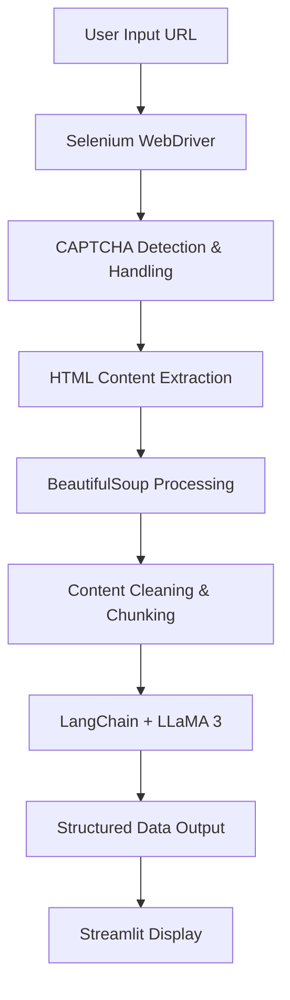

# 🤖 AI Web Scraper

[](https://python.org)
[](https://streamlit.io)
[](https://selenium.dev)
[](https://langchain.com)

> **An intelligent web scraping solution that combines automated browser automation with LLaMA 3 AI model for precise data extraction from any website.**


## 🌟 Features

- **🔍 Smart Web Scraping**: Automated browser-based scraping with CAPTCHA handling
- **🤖 AI-Powered Extraction**: Uses LLaMA 3 via Ollama for intelligent content parsing
- **🎯 Custom Query Processing**: Extract specific information with natural language instructions
- **🛡️ Anti-Detection**: Built-in mechanisms to bypass common scraping blocks
- **📱 Interactive UI**: Clean Streamlit interface for easy operation
- **⚡ Batch Processing**: Handles large content through intelligent chunking
- **🧹 Content Cleaning**: Advanced HTML parsing and text sanitization

## 🚀 Live Demo

Try the live demo: [AI Web Scraper](https://github.com/yashbhardwaj003/AI-webscrapper)

## 🏗️ Architecture



## 🛠️ Technology Stack

| Component | Technology | Purpose |
|-----------|------------|---------|
| **Frontend** | Streamlit | Interactive web interface |
| **Web Scraping** | Selenium WebDriver | Browser automation |
| **HTML Parsing** | BeautifulSoup4 | Content extraction & cleaning |
| **AI Processing** | LangChain + Ollama | Intelligent data parsing |
| **LLM Model** | LLaMA 3 | Natural language understanding |
| **Environment** | Python Virtual Environment | Dependency management |

## 📋 Prerequisites

- **Python 3.8+**
- **Chrome Browser** (for WebDriver)
- **Ollama** (for LLaMA 3 model)
- **4GB+ RAM** (recommended for AI model)

## ⚡ Quick Start

### 1. Clone & Setup Environment

```bash
git clone https://github.com/yashbhardwaj003/AI-webscrapper.git
cd AI-webscrapper

# Create virtual environment
python -m venv ai-webscrape

# Activate environment
# Windows PowerShell:
.\ai-webscrape\Scripts\Activate.ps1
# Windows CMD:
ai-webscrape\Scripts\activate.bat
# macOS/Linux:
source ai-webscrape/bin/activate
```

### 2. Install Dependencies

```bash
pip install -r requirements.txt
```

### 3. Setup Ollama & LLaMA 3

```bash
# Install Ollama (visit https://ollama.ai for installation)
# Pull LLaMA 3 model
ollama pull llama3

# Start Ollama service
ollama serve
```

### 4. Configure Environment

Create a `.env` file:
```env
SBR_WEBDRIVER=your_remote_webdriver_url_here
```

### 5. Launch Application

```bash
streamlit run main.py
```

Visit `http://localhost:8501` to access the application.

## 📖 Usage Guide

### Basic Scraping

1. **Enter URL**: Input any website URL in the text field
2. **Scrape Content**: Click "Scrape Website" to extract and clean content
3. **Review Data**: Examine the cleaned content in the expandable section

### AI-Powered Extraction

1. **Enter Query**: Describe what data you want to extract:
   - `"Extract all email addresses"`
   - `"Find product names and prices"`
   - `"Get contact information"`
   - `"List all links and their descriptions"`

2. **Parse Content**: Click "Parse Content" to process with AI
3. **Get Results**: View the precisely extracted structured data

### Example Queries

```
📧 Email Extraction:
"Extract all email addresses from this content"

🛍️ E-commerce Data:
"Find product names, prices, and descriptions"

📞 Contact Information:
"Get all phone numbers and contact details"

🔗 Link Analysis:
"List all external links with their anchor text"

📊 Table Data:
"Extract data from tables in a structured format"
```

## 🔧 Configuration

### WebDriver Setup

The project supports multiple WebDriver configurations:

- **Local Chrome**: Download ChromeDriver and add to PATH
- **Remote WebDriver**: Configure `SBR_WEBDRIVER` for services like Smartproxy
- **Headless Mode**: Modify `scrape.py` for background operation

### AI Model Customization

Modify `parse.py` to use different models:

```python
# Switch to different Ollama models
model = OllamaLLM(model="llama3:70b")  # Larger model
model = OllamaLLM(model="codellama")   # Code-focused model
```

## 📁 Project Structure

```
ai-webscrapper/
├── main.py              # Streamlit application entry point
├── scrape.py            # Web scraping logic with Selenium
├── parse.py             # AI-powered content parsing
├── requirements.txt     # Python dependencies
├── .env                 # Environment configuration
├── README.md           # Project documentation
└── ai-webscrape/       # Virtual environment
    ├── Scripts/        # Activation scripts
    └── ...
```

## 🧪 Code Examples

### Custom Scraping Function

```python
from scrape import scrape_website, clean_body_content

# Scrape any website
html_content = scrape_website("https://example.com")
clean_content = clean_body_content(html_content)
print(clean_content[:500])  # Preview first 500 characters
```

### AI Parsing Integration

```python
from parse import parse_with_ollama, split_dom_content

# Parse content with custom instructions
chunks = split_dom_content(content, max_length=6000)
results = parse_with_ollama(chunks, "Extract all product information")
```

## 🔍 Key Components Explained

### 1. Intelligent Web Scraping (`scrape.py`)
- **CAPTCHA Handling**: Automatic detection and solving
- **Content Extraction**: Focuses on `<body>` content only
- **Content Cleaning**: Removes scripts, styles, and unnecessary elements
- **Chunking**: Splits large content for optimal processing

### 2. AI-Powered Parsing (`parse.py`)
- **LangChain Integration**: Structured prompt management
- **Ollama Interface**: Local LLM processing
- **Batch Processing**: Handles large content efficiently
- **Structured Output**: Returns clean, formatted results

### 3. User Interface (`main.py`)
- **Session Management**: Maintains state between interactions
- **Real-time Processing**: Live feedback during operations
- **Result Display**: Clean, organized output presentation

## 🚀 Performance Optimization

- **Chunking Strategy**: 6000-character chunks for optimal AI processing
- **Memory Management**: Efficient content handling for large websites
- **Concurrent Processing**: Batch operations for speed
- **Cache Implementation**: Reduces redundant scraping operations

## 🔒 Ethical Considerations

- **Robots.txt Compliance**: Always check site policies before scraping
- **Rate Limiting**: Built-in delays to avoid overwhelming servers
- **Legal Usage**: Ensure compliance with website terms of service
- **Data Privacy**: Handle scraped data responsibly

## 🤝 Contributing

1. Fork the repository
2. Create a feature branch (`git checkout -b feature/amazing-feature`)
3. Commit your changes (`git commit -m 'Add amazing feature'`)
4. Push to the branch (`git push origin feature/amazing-feature`)
5. Open a Pull Request

## 🐛 Troubleshooting

### Common Issues

**ChromeDriver Issues**:
```bash
# Download ChromeDriver matching your Chrome version
# Add to system PATH or project directory
```

**Ollama Connection Problems**:
```bash
# Ensure Ollama service is running
ollama serve

# Check model availability
ollama list
```

**Memory Issues**:
- Reduce chunk size in `split_dom_content()`
- Use lighter AI models for resource-constrained environments

## 📈 Future Enhancements

- [ ] **Multi-format Export**: JSON, CSV, Excel output options
- [ ] **Scheduled Scraping**: Automated recurring data collection
- [ ] **Database Integration**: PostgreSQL/MongoDB storage
- [ ] **API Endpoints**: RESTful API for programmatic access
- [ ] **Docker Support**: Containerized deployment
- [ ] **Cloud Integration**: AWS/GCP deployment options
- [ ] **Advanced AI Models**: GPT-4, Claude integration
- [ ] **Real-time Monitoring**: Scraping job status tracking

## 📄 License

This project is licensed under the MIT License - see the [LICENSE](LICENSE) file for details.

## 👨‍💻 Author

**Yash Bhardwaj**
- GitHub: [@yashbhardwaj003](https://github.com/yashbhardwaj003)
- LinkedIn: [Your LinkedIn Profile](https://linkedin.com/in/your-profile)

---

<div align="center">

### ⭐ If you found this project helpful, please give it a star!


**[🔗 Repository Link](https://github.com/yashbhardwaj003/AI-webscrapper)** | **[📧 Report Issues](https://github.com/yashbhardwaj003/AI-webscrapper/issues)**

</div>
