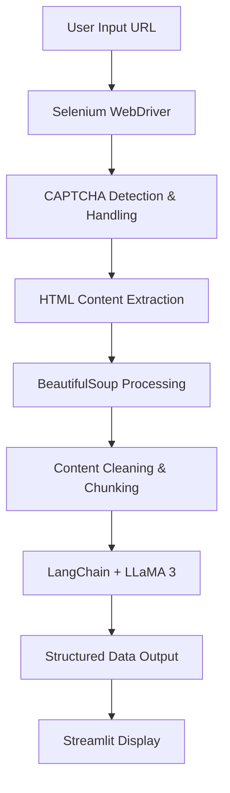

# 🤖 AI Web Scraper

[](https://python.org)
[](https://streamlit.io)
[](https://selenium.dev)
[](https://langchain.com)

> **An intelligent web scraping solution that combines automated browser automation with LLaMA 3 AI model for precise data extraction from any website.**


## 🌟 Features

- **🔍 Smart Web Scraping**: Automated browser-based scraping with CAPTCHA handling
- **🤖 AI-Powered Extraction**: Uses LLaMA 3 via Ollama for intelligent content parsing
- **🎯 Custom Query Processing**: Extract specific information with natural language instructions
- **🛡️ Anti-Detection**: Built-in mechanisms to bypass common scraping blocks
- **📱 Interactive UI**: Clean Streamlit interface for easy operation
- **⚡ Batch Processing**: Handles large content through intelligent chunking
- **🧹 Content Cleaning**: Advanced HTML parsing and text sanitization


## 🏗️ Architecture



## 🛠️ Technology Stack

| Component | Technology | Purpose |
|-----------|------------|---------|
| **Frontend** | Streamlit | Interactive web interface |
| **Web Scraping** | Selenium WebDriver | Browser automation |
| **HTML Parsing** | BeautifulSoup4 | Content extraction & cleaning |
| **AI Processing** | LangChain + Ollama | Intelligent data parsing |
| **LLM Model** | LLaMA 3 | Natural language understanding |
| **Environment** | Python Virtual Environment | Dependency management |


### Example Queries

```
📧 Email Extraction:
"Extract all email addresses from this content"

🛍️ E-commerce Data:
"Find product names, prices, and descriptions"

📞 Contact Information:
"Get all phone numbers and contact details"

🔗 Link Analysis:
"List all external links with their anchor text"

📊 Table Data:
"Extract data from tables in a structured format"
```

## 🔧 Configuration

### WebDriver Setup

The project supports multiple WebDriver configurations:

- **Local Chrome**: Download ChromeDriver and add to PATH
- **Remote WebDriver**: Configure `SBR_WEBDRIVER` for services like Smartproxy
- **Headless Mode**: Modify `scrape.py` for background operation

### AI Model Customization

Modify `parse.py` to use different models:

```python
# Switch to different Ollama models
model = OllamaLLM(model="llama3:70b")  # Larger model
model = OllamaLLM(model="codellama")   # Code-focused model
```

## 📁 Project Structure

```
ai-webscrapper/
├── main.py              # Streamlit application entry point
├── scrape.py            # Web scraping logic with Selenium
├── parse.py             # AI-powered content parsing
├── requirements.txt     # Python dependencies
├── .env                 # Environment configuration
├── README.md           # Project documentation
└── ai-webscrape/       # Virtual environment
    ├── Scripts/        # Activation scripts
    └── ...
```


## 🔍 Key Components Explained

### 1. Intelligent Web Scraping (`scrape.py`)
- **CAPTCHA Handling**: Automatic detection and solving
- **Content Extraction**: Focuses on `<body>` content only
- **Content Cleaning**: Removes scripts, styles, and unnecessary elements
- **Chunking**: Splits large content for optimal processing

### 2. AI-Powered Parsing (`parse.py`)
- **LangChain Integration**: Structured prompt management
- **Ollama Interface**: Local LLM processing
- **Batch Processing**: Handles large content efficiently
- **Structured Output**: Returns clean, formatted results

### 3. User Interface (`main.py`)
- **Session Management**: Maintains state between interactions
- **Real-time Processing**: Live feedback during operations
- **Result Display**: Clean, organized output presentation

## 🚀 Performance Optimization

- **Chunking Strategy**: 6000-character chunks for optimal AI processing
- **Memory Management**: Efficient content handling for large websites
- **Concurrent Processing**: Batch operations for speed
- **Cache Implementation**: Reduces redundant scraping operations


## 📈 Future Enhancements

- [ ] **Multi-format Export**: JSON, CSV, Excel output options
- [ ] **Scheduled Scraping**: Automated recurring data collection
- [ ] **Database Integration**: PostgreSQL/MongoDB storage
- [ ] **API Endpoints**: RESTful API for programmatic access
- [ ] **Docker Support**: Containerized deployment
- [ ] **Cloud Integration**: AWS/GCP deployment options
- [ ] **Advanced AI Models**: GPT-4, Claude integration
- [ ] **Real-time Monitoring**: Scraping job status tracking


## 👨‍💻 Author

**Yash Bhardwaj**
- GitHub: [@yashbhardwaj003](https://github.com/yashbhardwaj003)
- LinkedIn: [Your LinkedIn Profile](https://www.linkedin.com/in/yash-bhardwaj-602587218/)


</div>
